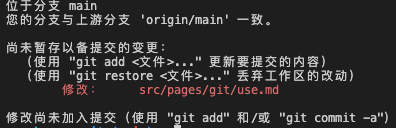

# git 使用

### 从服务器拉取代码

```shell
cd ~/Desktop/test
git clone https://xxx/test.git
```
>
代码拉取完成后会在`~/Desktop/test`目录下生成一个 test 文件夹

### 配置开发者用户名和邮箱

```shell
git config user.name xxx
git config user.email xxx@gmail.com
```
>
以后每次提交代码的时候都会有一条记录，记录中会包含用户名和邮箱

### 分支操作

```shell
# 通过git branch 创建一个分支
git branch test01/1.0.0
# 通过 -m参数可以为分支重命名，重命名后的分支名字为test01/1.0.1
git branch -m test01/1.0.0 test01/1.0.1
# 不携带任何参数可以查看当前项目的分支列表
git branch
# 通过 -d参数可以删除分支
git branch -d test01/1.0.1
# 创建一个新的分支
git branch test02/1.0.0
# 通过git checkout来切换分支，后续的操作都在test02/1.0.0分支上操作
git checkout test02/1.0.0
```

### 查看当前项目文件状态

```shell
# 查看状态
git status
```
>


### 常用操作

```shell
git add .
```
